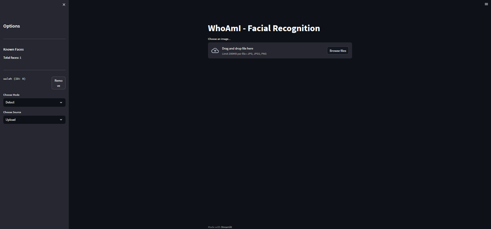

# WhoAmI - Advanced Facial Recognition App

A powerful and user-friendly facial recognition application built with Streamlit and OpenCV. This application allows real-time face detection, recognition, and management of known faces through an intuitive web interface.



## 🚀 Features

### Face Detection & Recognition
- Real-time face detection using OpenCV's Haar Cascade Classifier
- Face recognition using LBPH (Local Binary Pattern Histogram) algorithm
- Support for both image uploads and live camera feed
- Visual feedback with bounding boxes and name labels

### Training & Management
- Easy face training through camera capture or image upload
- Face management dashboard in the sidebar
- Ability to add and remove known faces
- Persistent storage of trained faces
- Support for multiple faces per person

### User Interface
- Clean and intuitive Streamlit web interface
- Real-time camera feed processing
- Simple mode switching between detection and training
- Progress indicators and success/error messages
- Responsive design

## 🛠 Installation

1. Clone the repository:
```bash
git clone https://github.com/saleheddinetouil/WhoAmI
cd WhoAmI
```

2. Create a virtual environment (optional but recommended):
```bash
python -m venv venv
source venv/bin/activate  # On Windows: venv\Scripts\activate
```

3. Install dependencies:
```bash
pip install -r requirements.txt
```

## 💻 Usage

1. Start the application:
```bash
streamlit run app.py
```

2. Access the web interface at `http://localhost:8501`

### Training Mode
1. Select "Train" mode from the sidebar
2. Choose your input source (Camera/Upload)
3. Enter a name for the face
4. Capture or upload an image
5. Verify the face was added in the sidebar

### Detection Mode
1. Select "Detect" mode from the sidebar
2. Choose your input source (Camera/Upload)
3. For camera: Click "Start Camera"
4. For upload: Select an image file
5. View results with labeled faces

## 🔧 Configuration

Edit `config.yaml` to customize:
- Camera resolution
- Face detection parameters
- Model storage paths
- Application settings

## 🏗 Project Structure
```
WhoAmI/
├── app/
│   ├── core/
│   │   ├── face_detector.py    # Face detection logic
│   │   └── face_recognizer.py  # Face recognition logic
│   └── utils/
│       ├── camera.py           # Camera handling
│       └── image_utils.py      # Image processing utilities
├── data/
│   └── models/                 # Trained models storage
├── config.yaml                 # Configuration file
├── requirements.txt           
└── app.py                      # Main application
```

## 🤝 Contributing

1. Fork the repository
2. Create a feature branch
3. Commit your changes
4. Push to the branch
5. Open a Pull Request

## 📝 License

This project is licensed under the MIT License - see the LICENSE file for details.

## 🔍 Technical Details

- **Face Detection**: Uses Haar Cascade Classifier
- **Face Recognition**: LBPH Face Recognizer
- **Frontend**: Streamlit
- **Image Processing**: OpenCV
- **Data Storage**: Pickle & YAML files

## ⚠️ Requirements

- Python 3.7+
- OpenCV with contrib modules
- Streamlit
- Webcam (for camera features)


This enhanced README provides:
- Clear installation and usage instructions
- Detailed feature descriptions
- Technical details
- Project structure
- Configuration guidance
- Contributing guidelines
- License information
- Requirements specification
